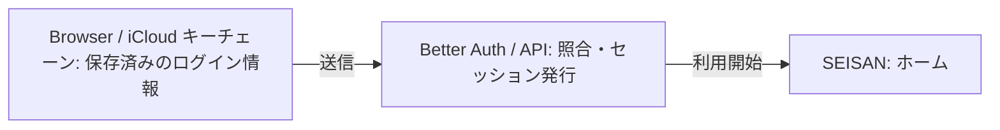

# すぐ使える、パスワード認証

通常ログインは、`users.email` をログイン ID として行います。パスワードは Better Auth の認証レコードへハッシュ化して保存し、Google OAuth は使用しません。

実装済み。Google OAuth の provider は削除し、seed 済みのメールアドレスとパスワードでログインします。

- **iCloud キーチェーン**: ブラウザが ID・パスワードを保存・自動入力する。
- **ハッシュ化して保存**: パスワードそのものを DB・ログ・Git に残さない。
- **2人の事前作成アカウント**: 公開サインアップは設けない。

## ログインフロー

- **Browser / iCloud キーチェーン**: ブラウザのパスワードマネージャで ID・パスワードを自動入力する。
- **Better Auth / API**: パスワードハッシュを照合し、Cookie session を発行する。
- **SEISAN / ホーム**: 保護された画面ですぐ記録する。

## アカウントはあらかじめ作成する

2人分のログイン ID と強いパスワードを seed 時に登録します。初回ログインの成功後、Safari にログイン情報を保存します。

1. **ログイン ID を登録する**: ユーザーごとに重複しない ID を `users` に保存する。
2. **パスワードをハッシュ化する**: 強いパスワードを seed 時に受け取り、ハッシュだけを User に紐づく認証レコードへ保存する。
3. **Safari に保存する**: 初回ログイン後の保存確認を承認する。以後は保存済みの ID・パスワードを自動入力できる。

## 端末を失ったとき・パスワードを忘れたとき

- **保存済みの端末がある**: iCloud キーチェーンからログイン情報を同期し、必要に応じて Safari に保存する。
- **ログイン情報を利用できない**: 本人確認後に新しい強いパスワードを発行し、認証レコードを更新して全セッションを失効する。

## 廃止・維持するもの

- **廃止する**: Google OAuth、Google の Client ID / Secret、公開サインアップ。
- **維持する**: Better Auth の ID・パスワード認証、Cookie session、事前作成済み User・Group・membership、ログアウトと保護ルート。
