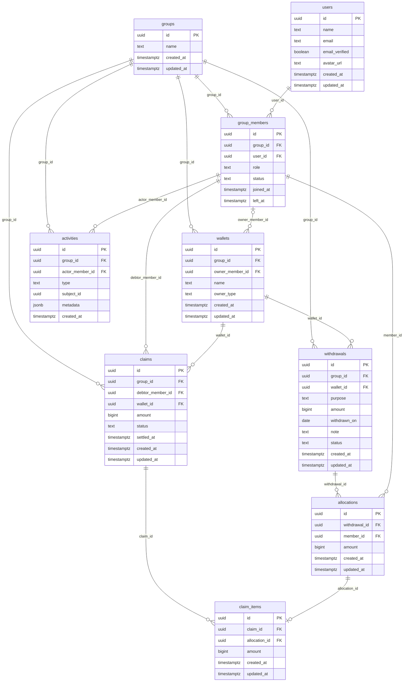
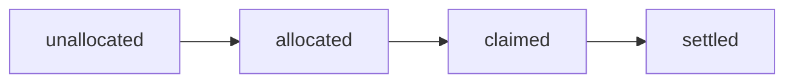
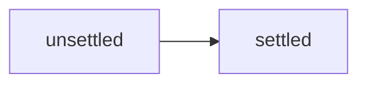

# Database design

Neon（PostgreSQL）と Drizzle ORM を前提に、財布からの出金、各メンバーの負担、返済依頼を分離して管理します。

## 運用方針

- **Neon branch**: `development` ブランチを開発環境、`production` ブランチを本番環境として使い分けます。開発中のスキーマ変更は production へ直接適用しません。
- **ORM**: Drizzle ORM を使用し、PostgreSQL のスキーマ定義、マイグレーション、型安全な DB アクセスを一元管理します。
- **Member limit**: 初期データは2人ですが、スキーマ上のメンバー数上限は設けません。

## ER 図

外部キー（**FK**）で親テーブルとの関係を表示します。出金・負担・請求の関係を、カラムとあわせて確認できます。

**所属:** User と Group は GroupMember で結びます。履歴を保持するため、脱退後も GroupMember を残します。

**請求:** Claim は請求対象メンバーと返済先 Wallet を持ち、ClaimItem で Allocation をまとめます。

**履歴:** Activity は対象 ID と表示用スナップショットを保持し、削除・変更後もタイムラインを表示できるようにします。

## リレーション一覧

| 親            | 多重度   | 子                                | 意味                             |
| ------------- | -------- | --------------------------------- | -------------------------------- |
| groups        | 1 : N    | group_members                     | グループの所属メンバー           |
| users         | 1 : N    | group_members                     | ユーザーは複数グループに所属可能 |
| groups        | 1 : N    | wallets                           | グループ内の個人・共有財布       |
| groups        | 1 : N    | withdrawals / claims / activities | 各業務データの所属先             |
| wallets       | 1 : N    | withdrawals                       | 出金は1つの財布から行う          |
| withdrawals   | 1 : N    | allocations                       | 出金をメンバーの負担額へ配分     |
| group_members | 1 : N    | allocations / claims / activities | 負担者・請求対象者・操作実行者   |
| claims        | 1 : N    | claim_items                       | 請求に含まれる内訳               |
| allocations   | 0..1 : 1 | claim_items                       | 1つの負担を1回だけ請求する       |

## テーブル定義案

型は PostgreSQL の型で記載しています。実装時は Drizzle のスキーマ定義とマイグレーションから Neon の各ブランチへ適用します。

### groups

メンバー・財布・出金・請求を共有する単位

| カラム                  | 型          | 制約・用途 |
| ----------------------- | ----------- | ---------- |
| id                      | uuid        | PK         |
| name                    | text        | NOT NULL   |
| created_at / updated_at | timestamptz | NOT NULL   |

### users

アプリを利用する人の基本情報

| カラム                  | 型          | 制約・用途                       |
| ----------------------- | ----------- | -------------------------------- |
| id                      | uuid        | PK                               |
| name                    | text        | NOT NULL                         |
| email                   | text        | NOT NULL, UNIQUE（小文字で保存） |
| email_verified          | boolean     | NOT NULL                         |
| avatar_url              | text        | NULL                             |
| created_at / updated_at | timestamptz | NOT NULL                         |

### group_members

ユーザーのグループ所属・ロール・在籍状態

| カラム              | 型          | 制約・用途      |
| ------------------- | ----------- | --------------- |
| id                  | uuid        | PK              |
| group_id            | uuid        | FK → groups     |
| user_id             | uuid        | FK → users      |
| role                | text        | owner \| member |
| status              | text        | active \| left  |
| joined_at / left_at | timestamptz | NOT NULL / NULL |

### wallets

出金元・返済先となる個人または共有のお金の保有単位

| カラム                  | 型          | 制約・用途                |
| ----------------------- | ----------- | ------------------------- |
| id                      | uuid        | PK                        |
| group_id                | uuid        | FK → groups               |
| owner_member_id         | uuid        | FK → group_members / NULL |
| name                    | text        | NOT NULL                  |
| owner_type              | text        | personal \| shared        |
| created_at / updated_at | timestamptz | NOT NULL                  |

### withdrawals

財布から金額を取り出し、用途を記録する。支払い取引そのものは管理しない

| カラム                  | 型          | 制約・用途                                     |
| ----------------------- | ----------- | ---------------------------------------------- |
| id                      | uuid        | PK                                             |
| group_id                | uuid        | FK → groups                                    |
| wallet_id               | uuid        | FK → wallets                                   |
| purpose                 | text        | NOT NULL                                       |
| amount                  | bigint      | NOT NULL, > 0                                  |
| withdrawn_on            | date        | NOT NULL                                       |
| note                    | text        | NULL                                           |
| status                  | text        | unallocated \| allocated \| claimed \| settled |
| created_at / updated_at | timestamptz | NOT NULL                                       |

### allocations

出金に対する各メンバーの負担額

| カラム                  | 型          | 制約・用途         |
| ----------------------- | ----------- | ------------------ |
| id                      | uuid        | PK                 |
| withdrawal_id           | uuid        | FK → withdrawals   |
| member_id               | uuid        | FK → group_members |
| amount                  | bigint      | NOT NULL, > 0      |
| created_at / updated_at | timestamptz | NOT NULL           |

### claims

メンバーから出金元財布への返済依頼。Withdrawal とは独立した集約

| カラム                  | 型          | 制約・用途           |
| ----------------------- | ----------- | -------------------- |
| id                      | uuid        | PK                   |
| group_id                | uuid        | FK → groups          |
| debtor_member_id        | uuid        | FK → group_members   |
| wallet_id               | uuid        | FK → wallets         |
| amount                  | bigint      | NOT NULL, > 0        |
| status                  | text        | unsettled \| settled |
| settled_at              | timestamptz | NULL                 |
| created_at / updated_at | timestamptz | NOT NULL             |

### claim_items

請求に含める負担の内訳。Claim と Allocation を結ぶ

| カラム                  | 型          | 制約・用途       |
| ----------------------- | ----------- | ---------------- |
| id                      | uuid        | PK               |
| claim_id                | uuid        | FK → claims      |
| allocation_id           | uuid        | FK → allocations |
| amount                  | bigint      | NOT NULL, > 0    |
| created_at / updated_at | timestamptz | NOT NULL         |

### activities

グループ内の操作履歴。タイムライン表示用の記録

| カラム          | 型          | 制約・用途              |
| --------------- | ----------- | ----------------------- |
| id              | uuid        | PK                      |
| group_id        | uuid        | FK → groups             |
| actor_member_id | uuid        | FK → group_members      |
| type            | text        | withdrawal_created など |
| subject_id      | uuid        | NOT NULL                |
| metadata        | jsonb       | NOT NULL, default {}    |
| created_at      | timestamptz | NOT NULL                |

## 制約と整合性

### PostgreSQL で担保するもの

- 主キー、外部キー、必須値、金額の正数チェック、状態値の `CHECK` 制約
- `group_members(group_id, user_id)` と `allocations(withdrawal_id, member_id)` の重複防止
- 個人財布は `owner_member_id` を必須、共有財布は NULL とする `owner_type` との整合性
- `claim_items(allocation_id)` の一意制約による同じ負担の二重請求防止
- `users.email` の一意制約。メールアドレスは小文字へ正規化して保存する。パスワードハッシュは User に紐づく Better Auth の認証用 `accounts` テーブルに保存する
- `withdrawals.wallet_id` と `claims.wallet_id` は `ON DELETE RESTRICT` とし、出金記録または請求が参照する財布の削除を拒否する

## 財布の削除

財布に無効状態は設けません。出金・請求から参照されていない財布だけを削除できます。 参照中の財布を削除しようとした場合は、PostgreSQL の外部キー制約によって処理を失敗させ、出金記録と請求の履歴を保護します。

### トランザクション内で検証するもの

- Allocation の合計額と Withdrawal 金額の一致
- Withdrawal、Wallet、Allocation、Claim のメンバーが同じ Group に属すること
- 個人財布からの出金では所有者以外の負担だけを請求すること、共有財布からの出金では各負担者へ請求すること
- ClaimItem の合計額と Claim 金額の一致、および関連する Claim がすべて精算済みになった Withdrawal だけを `settled` にすること

## 状態

### Withdrawal

請求を生成しない出金は `allocated` のままにします。

### Claim

返済元財布と返済方法は管理せず、返済先である Wallet と精算完了時刻だけを記録します。

## アクセスパターンとインデックス案

- グループ内の出金一覧: `withdrawals(group_id, withdrawn_on DESC)`
- 未精算請求: `claims(debtor_member_id, status, created_at DESC)`
- 返済先財布ごとの請求: `claims(wallet_id, status)`
- グループのタイムライン: `activities(group_id, created_at DESC)`
- 出金の負担・請求内訳: `allocations(withdrawal_id)`、`claim_items(claim_id)`
