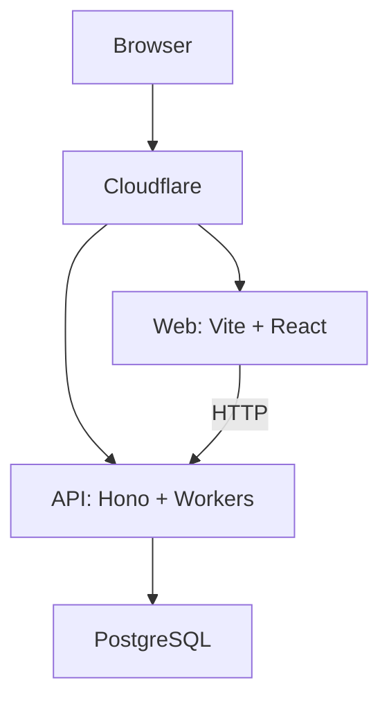

# System overview

画面を優先して検証し、責務が必要になった段階で API とデータベースを接続します。

## 役割

- **Web**: 画面表示、入力、ルーティング、API 呼び出しを担当します。
- **API**: 認証・認可、入力検証、業務ルール、トランザクション整合性を保証します。
- **Database**: グループ、財布、出金、負担、請求、履歴を永続化します。

[データベース設計を見る](database.md) / [認証設計を見る](authentication.md) / [API 設計を見る](api.md) / [技術スタックを見る](technology-stack.md) / [Server State の管理を見る](server-state.md)

## 技術スタック

全体構成と、フロントエンド・バックエンドの個別技術は [技術スタック](technology-stack.md) で管理します。導入済みの技術と、実装時に導入する予定の技術を分けて確認できます。

## 開発方針

1. **プロトタイプファースト:** 画面を作って操作し、仕様を継続的に更新します。
2. **MVP 優先:** 出金登録から精算までの流れを先に成立させます。
3. **段階的に接続:** API、DB、認証、永続化は、画面で仕様を確認しながら段階的に実装します。

## 初期画面と責務

Dashboard、Activity、Withdrawals、Claims、Wallets、Members、Group Settings を初期画面とし、画面構成はプロトタイプの検証に応じて変えます。Frontend は UI・操作・API 通信、Backend は業務ロジック・ドメインルール・整合性、Database は永続化を担当します。

## 設計原則

- フロントエンドへ業務ロジックを持たせず、業務ルールはバックエンドで保証します。
- 共通化は必要になった時点で行い、抽象化より変更容易性を優先します。
- MVP で価値を検証してから機能を追加します。
