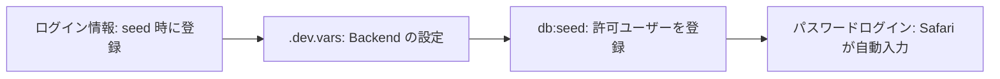
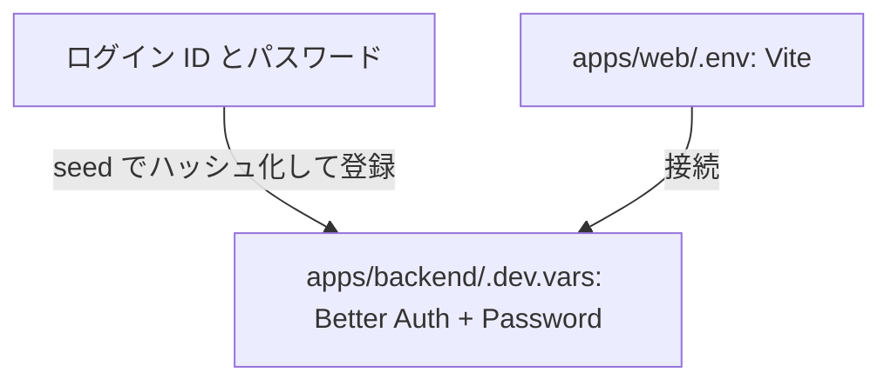

# ログインできるまでの設定マップ

設定する場所と値のつながりを、上から順に確認します。秘密値は Git やチャットへ保存しません。

ID・パスワード認証の設定です。Google OAuth 用の環境変数は使用しません。





## ログイン ID とパスワード

- **ユーザー 1**: : SEED_USER_1_EMAIL / PASSWORD
- **ユーザー 2**: : SEED_USER_2_EMAIL / PASSWORD
- **DB 保存**: : users.email と認証レコードのパスワードハッシュ

## Better Auth + Password

- **API URL**: : BETTER_AUTH_URL = http://localhost:8787
- **Session secret**: : BETTER_AUTH_SECRET = 32文字以上のランダム値
- **Web origin**: : WEB_ORIGIN = http://localhost:5173
- **Migration / seed**: : DATABASE_URL = Neon direct connection string

## Vite

- **API origin**: : VITE_API_ORIGIN = http://localhost:8787

## 最初の設定

1. **強いパスワードを生成する**

   ```sh
   openssl rand -base64 24
   ```

   ユーザーごとに別の値を作る。実値は Git・ログ・チャットへ残さない。

2. **ログイン情報をローカル設定へ入れる**

   ```dotenv
   SEED_USER_1_EMAIL="<email-address>"
   SEED_USER_1_PASSWORD="<strong-password>"
   ```

3. **ローカルファイルを作成する**

   ```sh
   cp apps/backend/.dev.vars.example apps/backend/.dev.vars
   cp apps/web/.env.example apps/web/.env
   ```

4. **シークレットを生成して設定する**

   ```sh
   openssl rand -base64 32
   ```

   出力を `BETTER_AUTH_SECRET` に設定する。

## 実行順序

```sh
pnpm --filter backend db:migrate
pnpm --filter backend db:seed
pnpm --filter backend dev
pnpm --filter web dev
```

`SEED_USER_1_EMAIL` と `SEED_USER_2_EMAIL` に設定した `db:seed` で作成した2 User だけがログインできます。初回ログイン後に Safari の保存確認を承認すると、次回から ID・パスワードを自動入力できます。

## 本番では URL と接続先を切り替える

- **DATABASE_URL**: Worker secret に設定する Neon production branch の pooled connection string
- **BETTER_AUTH_URL**: Worker secret に設定する `https://okaeshi-app.daxchx-v1.workers.dev`
- **BETTER_AUTH_SECRET**: Worker secret に設定する 32 文字以上の本番専用ランダム値
- **WEB_ORIGIN / VITE_API_ORIGIN**: Web と API を同じ Worker で配信するため、どちらも `https://okaeshi-app.daxchx-v1.workers.dev`

migration と seed は Worker 用の pooled connection string ではなく、production Neon branch の direct connection string を Git 管理外の `apps/backend/.dev.vars.production` に設定して実行します。実行時は `OKAESHI_ENV_FILE=.dev.vars.production` を指定し、development 用 `.dev.vars` と取り違えません。

`main` への push は GitHub Actions から本番へデプロイします。GitHub Actions secrets には `CLOUDFLARE_ACCOUNT_ID` と、対象 Account の Workers をデプロイできる 最小権限の `CLOUDFLARE_API_TOKEN` を設定します。Worker runtime の secret は Cloudflare 側で管理し、GitHub には保存しません。

## 変更時のルール

環境変数を追加・変更・削除するときは、このガイド、対応する `*.example`、README を同じ変更で更新する。
