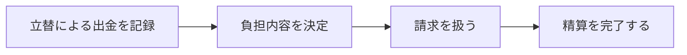
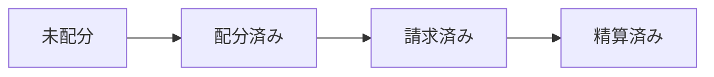
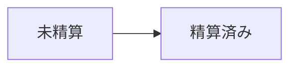

# Flows and states

立替による出金の記録、負担の決定、請求、精算を、情報が確定するタイミングごとに分けて扱います。

## Withdrawal lifecycle

## Claim lifecycle

出金記録、負担決定、請求、精算は直列の必須入力ではありません。出金の記録後、必要な時点で次の段階へ進みます。

## 利用開始と参加

事前に登録したログイン ID とパスワードでログインします。Safari のパスワード保存を承認すると、次回から ID・パスワードを自動入力できます。初期登録済みの共有 Group と2人分の所属情報を参照し、公開登録・グループ作成・招待フローは設けません。

## 出金記録

用途、金額、出金元財布、日付、必要に応じてメモを入力します。加盟店・支払方法などの支払い取引は管理しません。入力が有効なら、立替による出金の事実だけを未配分で保存し、登録アクティビティをタイムラインへ追加します。この時点では負担するユーザーや負担額を決定せず、請求も確定・生成しません。無効ならエラーを表示して修正を促します。

## 負担額と請求

記録済みの出金を後から確認して、各メンバーの負担内容を決定します。負担内容が決定されるまで請求は扱いません。決定済みの負担をもとに、各ユーザーが返済先財布へ返すべき金額を請求として扱います。負担額の具体的な決定方法、請求の生成方法・集約単位・生成タイミングは、このフローでは定めません。

## 精算と履歴

請求対象者は請求詳細で金額、返済先、内訳を確認し、任意の方法で返済します。精算完了後は Claim を精算済みにし、関連する請求がすべて精算済みなら Withdrawal も精算済みにします。出金記録、負担設定、請求作成、精算完了は、それぞれ行った時点でActivityとして記録します。

## 財布とメンバー

グループ参加者は共有財布と各メンバーの個人財布を参照できます。出金または請求に参照されている財布は削除できず、未参照の財布だけを削除できます。過去の出金、請求、履歴は保持します。
